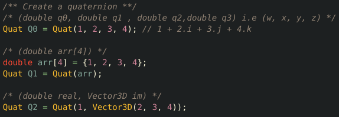
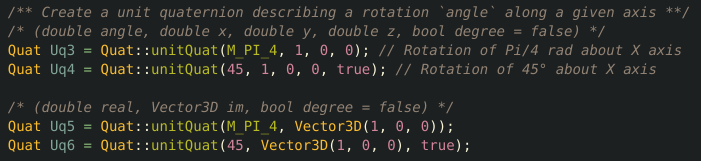
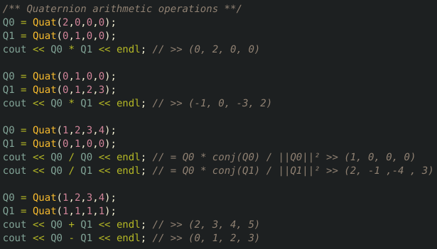
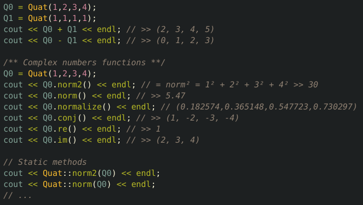
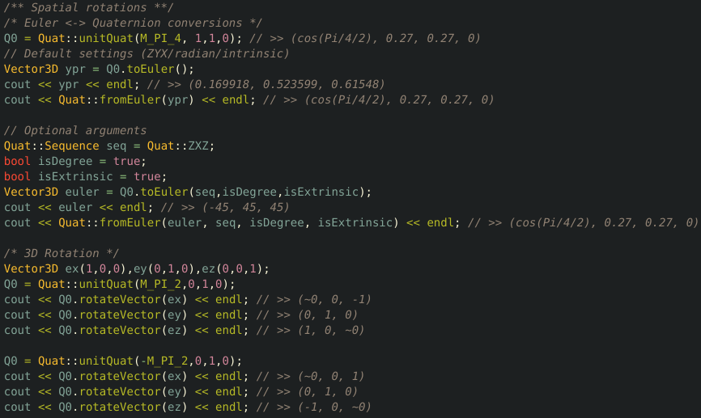

# Yet Another Quaternion Library

This library is meant to be a simple way to handle quaternion in C++ and use 
quaternion to deal with 3D rotations. This library can handle all Euler angle sequences (Tait-Bryan & Proper Euler angles)
with intrinsic or extrinsic convention (See [Davenport chained rotations](https://www.wikiwand.com/en/Davenport_chained_rotations#/Conversion_between_intrinsic_and_extrinsic_rotations)).
Functions are hardcoded as much as possible on purpose in order to improve performances for real time applications (Not ready for µC yet). 

yaql also provide a `Vector3D` class with overloaded arithmetic operators that you may use to apply rotation on.

## Create a quaternion
One can simply instantiate quaternions.

One can create unitary quaternions from angle/axis argument from `unitQuat`.
This function yield a normalized quaternion with respect to the specified angle, hence q0 is always equal to cos(angle/2),
then the imaginary part is adjusted such that the norm is unitary. (angle = 0 => Q = (1,0,0,0)).

See **Euler <=> Quaternion conversion** section for creating quaternion from Euler angles
## Arithmetic operation on quaternions
Most arithmetics operators have been overloaded.
`>>` works with std::cout, you can then print result directly in the standard output. 

Some other classic functions are implemented to handle complex numbers such as `norm`, `re`, `im` ...
Note that the initial object is **never** modified by the function itself. These functions always return 
a result without modifying anything.
Note that most of these functions have a static definition you can call directly from the class (Quat::Foo(Quat const & q) vs q.foo())

## Spatial rotations
You can convert back and forth quaternions to Euler.
Keep in mind that a set of Euler angle **does not** make any sense unless you specify the rotation sequence and convention used (intrinsic/extrinsic).
The default settings (and the most commonly used) is `ZYX`(yaw / pitch / roll) intrinsic expressed in radian.
The sequence can be selected through the `Sequence` enum in `Quat` class.

# TODOs

- Make ETL version of this library to be able to use it from a microcontroler (Planned on STM32)
- Make static functions inline to get rid of the Quat::foo and use directly foo instead
- Add conversion to/from rotation matrix
- Create a class 'Rotation', that wrap the whole thing, so that one can set its preferred settings during object instantiation (units/sequences/convention...) 

